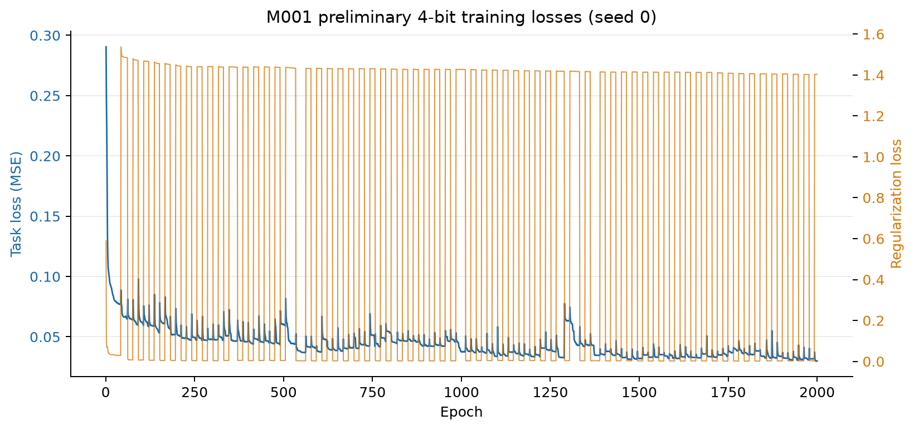
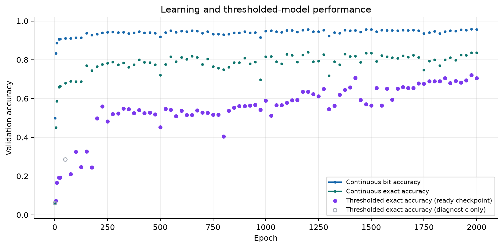
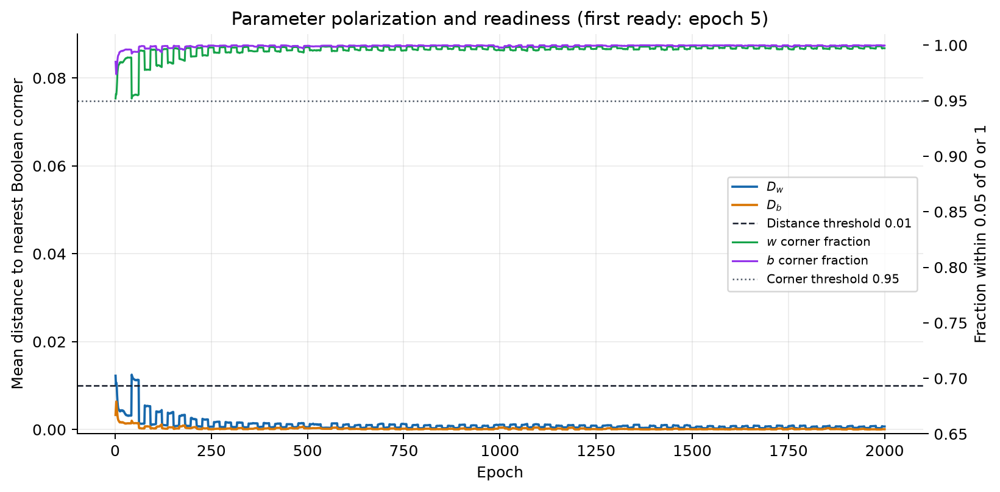
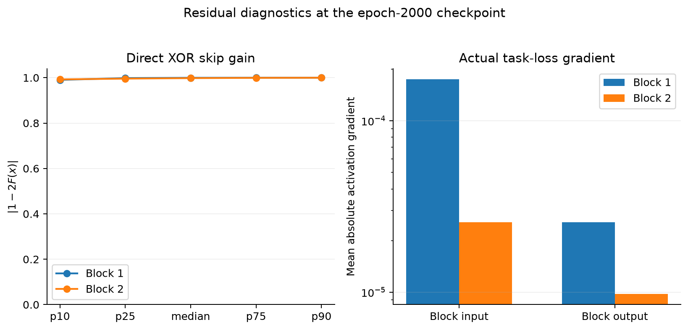

# Modern XOR-Residual Boolean Network: Research Report

**Report date:** 2026-09-17
**Working branch:** `research-modern-xor-residual`
**Experiment:** M001, seed 0, 4-bit smoke run
**Evidence status:** two completed, SHA-verified 2000-epoch Kaggle runs of the same M001 setup; the corrected run adds hard-max evaluation. No truth-table, no-residual, 16-bit, or multi-seed experiment has been run.

## Executive summary

This research phase corrects the previous topology: the historical `MultiLayerLogicGateNet` remains intact, and a separate modern network now has width-preserving XOR residual blocks. The modern graph is input → stem → two blocks of logic → logic → XOR with block input → output head. The matching discrete network uses the same skip locations and bitwise XOR.

The continuous/discrete topology has CPU tests that exhaust Boolean rows for a residual block and a complete tiny network. All 21 repository CPU tests passed after the implementation. A 4-bit M001 run completed 2000 epochs on a Kaggle Tesla T4 in 38.6 minutes. It became operationally near-Boolean early, but readiness did not mean task success: at epoch 5 the thresholded model had only 7.2% exact accuracy. At epoch 2000 the continuous model reached 95.6% bit accuracy and 83.6% exact accuracy; the thresholded Boolean model reached 91.5% bit and 70.6% exact accuracy. The continuous-to-discrete exact-accuracy gap was 13.0 percentage points.

Both residual branches were mostly polarized by the end. Their mean local direct XOR gains, `|1-2F(x)|`, were 0.978 and 0.990. Backpropagation transfer ratios from block output to input were above 1 for this diagnostic batch, so the earlier report's attenuation wording was reversed and has been corrected. There is no same-depth no-residual control, so these measurements do not establish that residuals improve gradient flow or task performance.

The first run did not calculate continuous hard-max accuracy. A corrected run on the same training configuration evaluated soft, hard-max, and Boolean inference on the same final checkpoint. Accuracy decreased in that order, showing that both aggregation and parameter thresholding contribute descriptively. The corrected SHA was verified.

## Architecture and implementation

### Boolean neuron

For each output unit `i` and input edge `j`:

```text
z_ij = w_ij AND (x_j XOR b_ij)
n_i  = OR_j z_ij
```

`w=0` removes an edge; `w=1` selects it. `b=0` selects the input literal and `b=1` selects its negation. The outer reduction is OR, with no output inversion.

The differentiable literal uses `x + b - 2xb`, and the selected contribution is `w * literal`. The existing soft aggregation is retained for training; this phase adds no OR surrogate.

### Modern graph

For block input `x`:

```text
h1 = LogicLayer1(x)
h2 = LogicLayer2(h1)
y  = x XOR h2
```

The continuous skip is `y = x + h2 - 2*x*h2`; the discrete skip is `y = x ^ h2`. Only width-matched `W → W → W` blocks receive a skip. No projection, adapter, padding, or truncation is used.

The implemented modern graph is:

```text
input → stem → [64→64 → 64→64 → XOR skip] × 2 → head
```

For the 4-bit smoke, the actual dimensions are `8→64`, four `64→64` block layers, then `64→4`. This gives 6 logic layers, 17,152 possible selected edges, 34,304 weight and bias scalars, and 6 learnable temperatures: 34,310 trainable scalars total. The 16-bit version would have 19,456 possible edges and 38,918 trainable scalars.

The deep control is supported by `residual_enabled=False`; it retains the same layers and parameter shapes. It has not been trained.

### Conversion and invariant tests

`ModernLogicGateNet.to_discrete()` creates a separate `DiscreteModernLogicGateNet`, thresholds the effective weights and biases at 0.5, and copies each layer into the same stem/block/head positions. It does not mutate the training model. The discrete residual blocks contain bitwise XOR at the same locations.

CPU tests check all four XOR endpoint combinations, all 8 Boolean inputs to a 3-wide residual block, and all 8 rows of a tiny two-block modern network with Boolean parameters and hard-max continuous layers. They also check that the no-residual control has identical parameter shapes. The full test command was:

```bash
pytest -q research/tests
```

Result: **21 passed**. A one-epoch local harness smoke also exercised the modern model, conversion, and block diagnostics. This verifies implementation invariants; it does not establish trained-model correctness.

## M001 experiment design

| Setting | Value |
|---|---|
| Task | sampled bitwise XOR, 4 input operand bits → 4 output bits |
| Seed | 0 |
| Data | 20,000 sampled operand pairs; seeded 80/20 random train/validation split (16,000 / 4,000) |
| Topology | stem width 64; 2 residual blocks, 2 logic layers each; 4-output head |
| Optimizer / loss | Adam, learning rate 0.01; MSE |
| Batch size | 256 |
| Budget | minimum configured 300; maximum 2000; metrics checked every 25 epochs (plus early diagnostic points) |
| Regularization | recovered `regularization_factory2`: `disc_lambda=0.5`, `tau_lambda=0.3`, patience 15, minimum error 0.01, isolate on plateau |
| Plateau constraint | Gaussian weight noise, std 0.3, patience 15, minimum delta 0.01 |
| Temperature | learnable per logic layer, initialized to 1.0; no new annealing policy |
| Conversion threshold | 0.5 |
| Readiness rule | `D_w≤0.01`, `D_b≤0.01`, `w_corner_05≥0.95`, `b_corner_05≥0.95` |
| Hardware / runtime | Kaggle Tesla T4; 2,316.4 seconds (38.6 minutes) |
| Packaged revision | `091faa02bd60a8cb2f53fe6efb800fb3c5c9cb6f`, Kaggle kernel version 11; returned SHA matched |
| Corrected evaluation revision | `1f25331357476462c947b7269a47c8ebada920c9`, Kaggle kernel version 12; returned SHA matched; 2140.1 seconds |

Layer initializers were specified explicitly, using normal distributions with these means: stem 1.0; block 0 layer 1: 0.0; block 0 layer 2: 1.0; block 1 layer 1: 0.0; block 1 layer 2: 1.0; head: 0.0. Bias initialization mean was 1.0 at every layer. The initial effective parameter means after `[0,1]` clamping were not equal to those raw initializer means; measured weight means by layer were 0.599, 0.270, 0.174, 0.154, 0.237, and 0.103. Initial bias means were 0.678, 0.684, 0.694, 0.656, 0.680, and 0.676.

The dataset is sampled, rather than an exhaustive 8-bit input truth table. Validation metrics are therefore on 4,000 held-out sampled pairs, not every possible pair. The split is seeded through the configured seed and PyTorch RNG.

## Training trajectory

The archived complete trajectory is in [`091faa0_M001_modern_4bit_preliminary.json`](../kaggle/results/091faa0_M001_modern_4bit_preliminary.json). It contains an entry per epoch. The plotted discrete values are thresholded diagnostic outputs until the corresponding checkpoint meets the readiness rule; readiness itself is recomputed each epoch and is not monotonic.





The trajectory plot above is from kernel version 11 and does not include
hard-max values. Kernel version 12 evaluated the final checkpoint three ways:

| Inference mode | Validation bit accuracy | Validation exact accuracy |
|---|---:|---:|
| Continuous soft aggregation | 0.95625 | 0.83575 |
| Continuous hard-max | 0.9388125 | 0.77025 |
| Exact discrete Boolean | 0.914625 | 0.70550 |

Soft-to-hard gaps are 1.744 bit-accuracy points and 6.550 exact-accuracy
points. Hard-to-Boolean gaps are 2.419 and 6.475 points. Thus the pattern is
`soft > hard > Boolean`: both aggregation and thresholding contribute
descriptively, with similar exact-accuracy gaps. Exact accuracy is nonlinear,
so these differences are not additive causal effects. The corrected-run
artifact is
[`1f25331_M001_modern_4bit_corrected.json`](../kaggle/results/1f25331_M001_modern_4bit_corrected.json).



| Epoch | Task loss | Regularization loss | Continuous bit acc. | Continuous exact acc. | Thresholded bit acc. | Thresholded exact acc. | `D_w` | `D_b` | Ready? |
|---:|---:|---:|---:|---:|---:|---:|---:|---:|:---:|
| 0 | — | — | 0.4991 | 0.0585 | 0.5009 | 0.0608 | 0.08560 | 0.08541 | No |
| 1 | 0.2905 | 0.5891 | 0.4991 | 0.0585 | 0.5009 | 0.0608 | 0.01224 | 0.00331 | No |
| 5 | 0.1336 | 0.0696 | 0.8334 | 0.4505 | 0.5046 | 0.0723 | 0.00787 | 0.00419 | Yes |
| 25 | 0.0801 | 0.0308 | 0.9074 | 0.6638 | 0.6376 | 0.1923 | 0.00370 | 0.00139 | Yes |
| 50 | 0.0665 | 1.4880 | 0.9100 | 0.6800 | 0.7085 | 0.2855 | 0.01134 | 0.00143 | **No** |
| 100 | 0.0624 | 0.0067 | 0.9146 | 0.6880 | 0.7376 | 0.3253 | 0.00117 | 0.00024 | Yes |
| 300 | 0.0477 | 1.4410 | 0.9404 | 0.7753 | 0.8534 | 0.5233 | 0.00160 | 0.00025 | Yes |
| 1000 | 0.0378 | 1.4269 | 0.9493 | 0.8158 | 0.8737 | 0.5903 | 0.00111 | 0.00044 | Yes |
| 1500 | 0.0321 | 0.0024 | 0.9566 | 0.8353 | 0.8707 | 0.5643 | 0.00037 | 0.00007 | Yes |
| 2000 | 0.0300 | 1.4032 | 0.9563 | 0.8358 | 0.9146 | 0.7055 | 0.00068 | 0.00007 | Yes |

The first operational readiness checkpoint was epoch 5. The model was not ready at epoch 50, then was ready again at epoch 100 and at epoch 2000. This matters: “first ready” is a trajectory event, not a permanent state guarantee. At epoch 5, polarization was already sufficient under the operational thresholds while thresholded exact accuracy was only 7.2%; this directly demonstrates that polarization alone is not task success.

Task accuracy continued to improve well after first readiness. Continuous exact accuracy reached a sampled-checkpoint maximum of 0.84 at epoch 1200, and was 0.83575 at epoch 2000. It was still moving near the max budget, but it had largely plateaued from epoch 1200 onward and was non-monotonic. No best-task or best-ready model checkpoint was saved; the JSON preserves metrics, not model weights. The requested checkpoint selection strategy remains an implementation gap.

The regularization loss is highly variable, with large spikes at epochs such as 50, 300, 1000, 1750, and 2000. The task loss is reported separately and declines overall. The total objective should not be read as task error.

The run used the full configured 2000-epoch maximum. It did not implement a validation-driven convergence stop; `min_epochs=300` and `check_every=25` are configuration/measurement settings, while stopping was fixed at the maximum. The trace therefore shows behavior at the ceiling but does not claim formal convergence.

At the final checkpoint, `w_corner_05=0.99720`, `b_corner_05=0.99959`, `D_w=0.000685`, and `D_b=0.0000662`. The final learned temperatures ranged from 0.0270 to 0.1382 (taus 7.24 to 36.99). This is substantial polarization, but the exact Boolean model still did not match continuous exact accuracy.

## XOR residual behavior and gradients

The following activation summaries use the final soft model over the 4,000 validation rows. “Middle” is activation in `(0.25, 0.75)`; “near 0/1” means `≤0.05` / `≥0.95`. Entropy is mean binary entropy in bits.

| Block | Signal | Mean | Variance | Near 0 | Near 1 | Middle | Entropy (bits) |
|---|---|---:|---:|---:|---:|---:|---:|
| 1 | input `x` | 0.914 | 0.076 | 0.080 | 0.907 | 0.007 | 0.014 |
| 1 | first layer `h1` | 0.887 | 0.096 | 0.106 | 0.878 | 0.014 | 0.021 |
| 1 | branch `F(x)=h2` | 0.782 | 0.163 | 0.200 | 0.764 | 0.022 | 0.039 |
| 1 | XOR output `y` | 0.240 | 0.172 | 0.737 | 0.216 | 0.029 | 0.051 |
| 2 | input `x` | 0.240 | 0.172 | 0.737 | 0.216 | 0.029 | 0.051 |
| 2 | first layer `h1` | 0.868 | 0.108 | 0.122 | 0.858 | 0.017 | 0.034 |
| 2 | branch `F(x)=h2` | 0.951 | 0.043 | 0.043 | 0.947 | 0.009 | 0.024 |
| 2 | XOR output `y` | 0.758 | 0.171 | 0.215 | 0.732 | 0.035 | 0.069 |

The residual branches are mostly near Boolean values, especially block 2. The branch-threshold flip fractions are 0.7884 (block 1) and 0.9530 (block 2); for these thresholded values, the fraction of output bits differing from the block input is the same. Those measurements describe substantial representation changes; they do not say whether the changes help the task.

The direct derivative diagnostic is `|1-2F(x)|`, calculated from the continuous branch output at the final checkpoint:

| Block | Mean | Median | p10 | p25 | p75 | p90 | `<0.1` | `<0.25` | `>0.75` | `>0.9` |
|---|---:|---:|---:|---:|---:|---:|---:|---:|---:|---:|
| 1 | 0.9777 | 0.9996 | 0.9904 | 0.9983 | 0.9999 | 1.0000 | 0.0027 | 0.0094 | 0.9701 | 0.9643 |
| 2 | 0.9897 | 0.9981 | 0.9926 | 0.9959 | 0.9994 | 0.9999 | 0.0012 | 0.0066 | 0.9907 | 0.9904 |



These final gains show that the local direct derivative was usually near magnitude 1 rather than near zero. They do **not** prove that the full network’s gradients were preserved: the nonlinear branch derivatives and downstream layers still affect the total gradient, and there is no no-residual control for comparison.

Backpropagation travels from block output `y` to block input `x`. On a 512-row validation diagnostic batch, measured backward gradient transfer was:

| Block | `||grad_input|| / ||grad_output||` | `mean_abs_grad_input / mean_abs_grad_output` | Input/output gradient norms |
|---|---:|---:|---:|---:|
| 1 | 4.047 | 6.831 | 0.0608 / 0.0150 |
| 2 | 1.149 | 2.611 | 0.0150 / 0.0131 |

The gradients were larger at the block input than output. Because backpropagation goes output-to-input, these ratios are above 1 and do not show backward attenuation across the measured block activations. Magnitudes remain small in absolute terms, especially by the second block. This single-model measurement cannot establish a residual advantage without the matched control.

The first run recorded only `abs(1-2F(x))`, not signed `1-2F(x)`, so positive versus negative direct derivatives were not counted. Absolute gain near 1 is consistent with either `F≈0` and a positive path or `F≈1` and a sign-reversed path. Signed statistics remain unmeasured.

As a Boolean flip mask, the branch is mostly 1 on these activations: block 1 mask-1 fraction 0.7884 (mask-0 0.2116), block 2 mask-1 fraction 0.9530 (mask-0 0.0470). The output differs from its input at those rates. A mask near 1 behaves approximately like NOT on those bits; this describes the learned transformation without judging it.

Named parameter-gradient mean magnitudes at the final epoch were: stem `3.38e-4`; block 1 layer 1 `2.45e-5`; block 1 layer 2 `1.34e-5`; block 2 layer 1 `7.92e-6`; block 2 layer 2 `3.79e-6`; head `6.70e-5`. The small gradients in later block logic layers are a potential failure mode worth examining in the next approved experiment.

## Boolean circuit size and semantic comparison

At epoch 2000 the thresholded network selected 3,756 of 17,152 possible edges (21.90%). There were 2,593 selected negated-polarity edges (69.04% of selected edges).

| Logic layer | Shape | Selected edges | Selected fraction | Selected negated edges |
|---|---:|---:|---:|---:|
| Stem | 8→64 | 306 | 59.77% | 205 |
| Block 1, layer 1 | 64→64 | 1,108 | 27.05% | 785 |
| Block 1, layer 2 | 64→64 | 713 | 17.41% | 508 |
| Block 2, layer 1 | 64→64 | 631 | 15.41% | 395 |
| Block 2, layer 2 | 64→64 | 971 | 23.71% | 677 |
| Head | 64→4 | 27 | 10.55% | 23 |

The corrected run separates the preliminary 13.025-point soft-to-Boolean exact gap into a 6.550-point soft-to-hard gap and a 6.475-point hard-to-Boolean gap. The conversion invariants pass exactly at Boolean endpoints in local exhaustive tests. At this near-corner checkpoint, thresholding small residual parameter fractions and their propagation through later layers may explain some of the hard-to-Boolean difference. Model weights were not saved, so this could not be probed layer by layer.

1. Continuous model with existing soft aggregation.
2. Continuous model with hard-max logic layers.
3. Separate discrete Boolean model.

The corrected run was Kaggle kernel version 12 from commit `1f25331357476462c947b7269a47c8ebada920c9`; its returned SHA matched. It completed 2000 epochs in 2140.1 seconds on a Tesla T4. Its training configuration and seed match the first run; the corrected revision adds hard-max evaluation.

## What the results support—and what they do not

Supported by current evidence:

- The modern topology is implemented independently from the historical model, including an exact discrete counterpart.
- Continuous XOR at Boolean endpoints and small-network hard-max/discrete equivalence pass exhaustive CPU checks.
- On the sampled 4-bit task, the model learned substantially above chance and polarized strongly under the recovered training setup.
- Task metrics improved after first readiness, confirming that training should not stop merely when the weights polarize.
- The residual branches ended near Boolean corners; their local direct XOR gain was usually close to 1.
- The preliminary thresholded model learned XOR better than chance but underperformed the continuous model on validation accuracy.

Not established:

- Whether continuous hard-max matches the discrete result exactly at the ready checkpoint. Their exact accuracies differ by 6.475 points although endpoint tests pass; no model checkpoint is available for deeper mismatch analysis.
- Whether XOR residuals improve gradients or task learning. There is no matched no-residual run.
- Whether 16-bit XOR is learnable under this setup. No 16-bit run was started.
- Whether these metrics reproduce across seeds. Only seed 0 was run.
- Whether readiness thresholds are scientifically optimal. They are bookkeeping thresholds only.
- Whether the best continuous or best ready checkpoint would outperform the final epoch. Model-state checkpoints were not saved.

## Files and Git record

The implementation and archived experiment history are preserved on `research-modern-xor-residual`. The old `MultiLayerLogicGateNet` and `DiscreteMultiLayerLogicGateNet` remain available as the historical baseline.

- `layers.py`: continuous XOR helper and `XorResidualLogicBlock`.
- `models.py`: new `ModernLogicGateNet`, retaining `MultiLayerLogicGateNet`.
- `discrete_logic_net.py`: `DiscreteXorResidualLogicBlock` and `DiscreteModernLogicGateNet`.
- `research/run_experiment.py`: selectable modern model, readiness trajectory, residual activation/gain/gradient diagnostics, and hard-max comparison in the corrected commit.
- `research/tests/test_modern_xor_residual.py`: CPU invariants.
- `research/configs/M001_modern_4bit.json`: exact 4-bit M001 configuration.
- `research/modern_architecture_research.md`: append-only experiment notebook.
- `research/plot_modern_architecture_report.py`: matplotlib source for all plots in this report.
- `research/figures/`: generated PNG figures.

Commits, oldest first: `e67e2d7` architecture notes/config; `3351c57` modern continuous/discrete models; `b85e717` equivalence tests; `d0b09af` instrumentation/initialization record; `091faa0` readiness trajectory; `b8d2626` hard-max comparison; `1f25331` preliminary M001 result record.

The preliminary JSON is an ignored Kaggle artifact, preserved locally under `kaggle/results/`. The figures can be rebuilt with:

```bash
MPLCONFIGDIR=/tmp/mplconfig python research/plot_modern_architecture_report.py
```

## Current research position

M001’s 4-bit run shows partial task learning, strong Boolean polarization, and a material soft-to-discrete gap. Readiness by itself was an unreliable proxy for task success, and the run continued learning after it first became ready. The branch measurements are consistent with a strong local XOR skip derivative, but actual activation gradients still attenuate through the blocks. The data do not yet tell us whether the residual architecture is better than an equally deep network without residuals.

The corrected soft/hard/Boolean comparison is complete and appended to the canonical notebook. It shows that both the continuous aggregation and thresholding matter on this run. No exact truth-table or matched no-residual experiment has been run. Those are the next controlled questions; no temperature, regularization, stochastic-inference, or MNIST experiment has been run.
