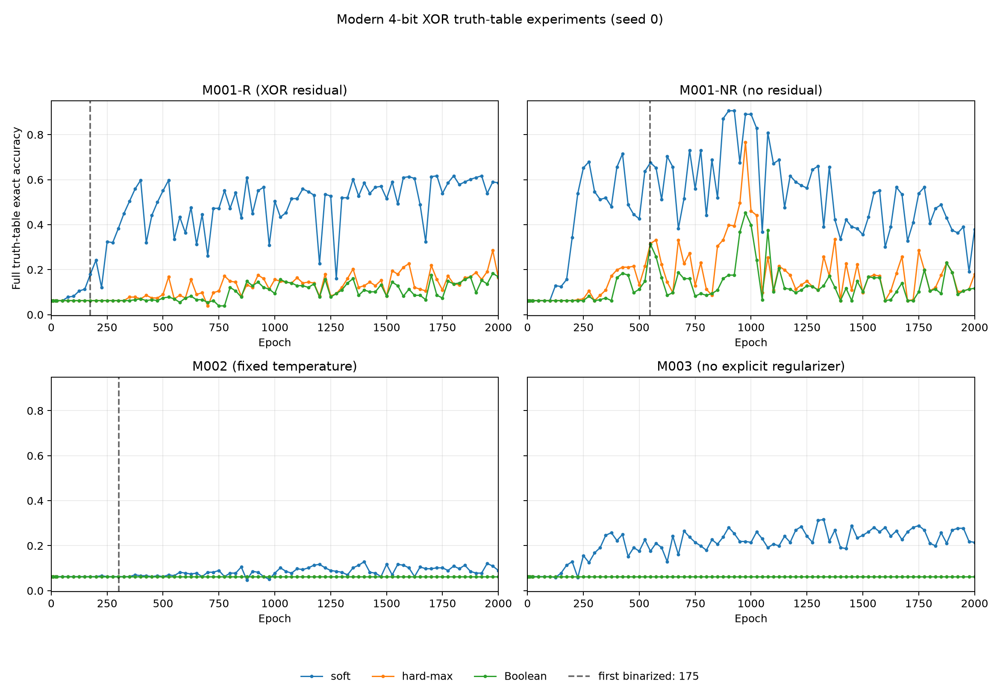

# Modern XOR-Residual Boolean Network Research

## Architecture specification

### Discrete neuron

z_ij = w_ij AND (x_j XOR b_ij)
n_i = OR_j z_ij

### Continuous literal

xor(x,b) = x + b - 2xb

### XOR residual block

h1 = L1(x)
h2 = L2(h1)
y = XOR(x,h2)

### Dimension rule

Direct XOR residuals are allowed only when dimensions match.
No learned projection is used in the initial architecture.

### Discretization philosophy

The discrete Boolean network is the actual target model.
The continuous model is an optimization surrogate.

Discrete evaluation is considered scientifically meaningful
only after weights and biases are sufficiently close to {0,1}.

The initial operational definition of `DISCRETIZATION_READY` is D_w <= 0.01,
D_b <= 0.01, w_corner_05 >= 0.95, and b_corner_05 >= 0.95. These are
experiment bookkeeping thresholds, not established scientific constants.

## Experiment index

| ID | Git SHA | hypothesis | task | topology | seed | result |
|---|---|---|---|---|---|---|
| M001 | 1f25331357476462c947b7269a47c8ebada920c9 | XOR residual blocks can train, polarize, and discretize faithfully | sampled bitwise_xor, 4-bit | stem 64, two 64-wide two-layer XOR blocks, head | 0 | 2000 epochs; soft/hard/Boolean exact 0.83575/0.77025/0.70550; ready first at 5 |
| M001-R | `6a33da88923b466e6498ef940d46b02742fc82e2` | Evaluate exact full-table recovery with residual topology | exact 256-row table | stem64 + 2 residual blocks + head | 0 | 2000 epochs; function recovery false; soft/hard/Boolean exact 0.5859/0.1641/0.1680; T4 62.0s |
| M001-NR | `feb9db19e6bf4be4ae73699f5bca183c78683d5a` | Matched same-depth graph without residual XOR | exact 256-row table | same modern layers, residual disabled | 0 | 2000 epochs; function recovery false; final soft/hard/Boolean exact 0.3789/0.1797/0.1172; T4 70.1s |
| M002 | `f8e998fdb4948d48f7f24122de2534874e83116a` | Test whether learned temperature dynamics are needed | exact 256-row table | modern residual, tau fixed at 1 | 0 | 2000 epochs; polarized but near-chance exact accuracy 0.0898/0.0625/0.0625; T4 55.6s |
| M003 | `62f17059b1dc66094f1cb4e633ccc1d6585c6218` | Test task optimization without explicit weight/bias regularization | exact 256-row table | modern residual, fixed temperature, no regularizer | 0 | 2000 epochs; best soft exact 0.3164; final parameters not binarized; Boolean diagnostic exact 0.0625; T4 50.3s |

## M001 — Modern XOR-residual baseline

### Hypothesis

A width-preserving XOR residual topology can learn bitwise XOR, polarize its
parameters under the recovered discretization-oriented training setup, and
produce a discrete network consistent with its continuous hard-max graph.

### Exact code state

Architecture/test source SHA: `b85e717`; completed corrected training package:
`1f25331357476462c947b7269a47c8ebada920c9` (Kaggle kernel version 12; returned
SHA verified).

### Architecture

ModernLogicGateNet: input -> stem -> two 64->64 logic layers plus elementwise
XOR with the block input (for each of two blocks) -> output head. Direct skips
are only applied at width 64. The no-residual control uses the same layers,
shapes, initialization sequence, and dimensions with only those XOR operations
disabled. No OR surrogate, adapter, projection, or threshold change is used.

For the 4-bit smoke (input 8, output 4), the six layer dimensions are
8->64, 64->64, 64->64, 64->64, 64->64, 64->4. Initializer means by index are:
stem 1.0; block0.layer0 0.0; block0.layer1 1.0; block1.layer0 0.0;
block1.layer1 1.0; head 0.0. Bias initialization mean is 1.0 for every layer.
The 4-bit graph has 17,152 possible selected edges, 34,304 weight/bias scalar
parameters, and 6 learnable temperatures (34,310 trainable scalars). The
16-bit graph has 19,456 possible selected edges, 38,912 weight/bias scalars,
and 6 temperatures (38,918 trainable scalars).

Discrete conversion copies thresholded effective weights and biases into a new
DiscreteModernLogicGateNet and keeps the same residual positions.

### Training configuration

Completed seed-0 sampled 4-bit run. The corrected evaluation used the same
final checkpoint for soft, hard-max, and discrete inference. The dataset uses
20,000 seeded operand pairs and an 80/20 train/validation split. No 16-bit run
has been started.

The configured alternating initializer is listed by explicit layer index in
the M001 config. Bias initialization remains the recovered baseline setting.

### Discretization-readiness definition

Ready iff D_w <= 0.01 AND D_b <= 0.01 AND w_corner_05 >= 0.95 AND
b_corner_05 >= 0.95. Threshold 0.5 is used for conversion. Before readiness,
thresholded measurements are labeled diagnostic_only and do not support a
claim about discretization success or failure.

### Training trajectory

Recorded for every epoch: task/regularization/total loss, accuracy at
measurement checkpoints, D_w/D_b, corner fractions, readiness, diagnostic
discrete accuracies, temperature, and tau. Full JSON is archived below.

### Residual-block behavior

Recorded for both blocks on the final validation pass: input, first logic
output, residual branch, XOR output distributions and thresholded flip rates.

### Gradient behavior

The first run recorded absolute direct gain only; it did not retain the signed
direct derivative. Named parameter gradients and actual activation gradients
are in the report. The corrected evaluation adds hard-max predictions but
does not retrain or change those gradient measurements.

### Continuous performance

See completed result below.

### Boolean polarization

First ready at epoch 5; readiness was false again at epoch 50. Final D_w and
D_b were 0.000685 and 0.0000662. Polarization alone was not task success.

### Discrete performance after readiness

Completed at the epoch-2000 parameter-binarized checkpoint. Soft, hard-max,
and exact Boolean predictions were evaluated on the same 4,000 validation
rows. Earlier thresholded outputs remain diagnostic only.

### Continuous/discrete gap

Hard-max remained above the Boolean result by 6.475 percentage points in exact
accuracy. Endpoint equivalence tests pass. The near-corner checkpoint weights
were not saved, so the remaining threshold/margin effects could not be probed
per layer after training.

### Result

The model learned and polarized, but the final discrete result remained below
the continuous soft and hard-max results. See the complete three-way result
and interpretation below; this is partial function recovery, not success.

### Interpretation

Both continuous aggregation and parameter thresholding contributed to the
observed exact-accuracy gaps. This does not establish whether XOR residuals
help relative to a matched no-residual topology.

### Open questions

Does F(x) move toward 0/1 and keep the direct XOR gradient path usable? Does the
residual model outperform the same deep no-residual topology? Does either model
reach readiness while retaining task performance?

### M001 preliminary 4-bit run (measurement incomplete)

The first committed Kaggle run used code SHA `091faa02bd60a8cb2f53fe6efb800fb3c5c9cb6f`,
seed 0, 20,000 sampled examples, 80/20 train/test split, and all 2000 epochs.
Returned SHA matched. The original artifact is
`kaggle/results/091faa0_M001_modern_4bit_preliminary.json`. It recorded epoch-0
continuous exact accuracy 0.0585, bit accuracy 0.499125, D_w 0.08560, D_b
0.08541; first operational readiness was epoch 5. At epoch 2000, validation
continuous exact/bit accuracy was 0.83575/0.95625, thresholded discrete exact/bit
accuracy was 0.7055/0.914625, D_w 0.000685, D_b 0.0000662, and 3,756 of 17,152
possible edges were selected. Task loss was 0.03004; reported regularization
loss was 1.4032. The model was still improving in continuous exact accuracy
from 0.0585 at epoch 0 to 0.83575 at the budget ceiling. The direct-gain means
were 0.9777 and 0.9897 in blocks 0 and 1; block branch flip fractions were
0.7884 and 0.9530. These are preliminary only: this run omitted the continuous
hard-max prediction measurement needed to validate agreement with the discrete
graph, so it is not the final M001 comparison. No 16-bit or no-residual run was
started from this incomplete measurement.

That statement records the decision at the time of the preliminary run. The
corrected M001 comparison has since completed and is recorded below; the
matched control and truth-table experiment remain unrun.

Full narrative, trajectory figures, block statistics, limitations, and the
current stopping point are in [`modern_architecture_report.md`](modern_architecture_report.md).

### M001 corrected three-way evaluation

#### Parent experiment

The preliminary M001 run at commit `091faa02bd60a8cb2f53fe6efb800fb3c5c9cb6f`;
same seed, data, initialization, optimizer, regularization, architecture, and
training budget.

#### Hypothesis

Separate the validation gap from continuous soft aggregation to hard-max, and
from hard-max continuous inference to the exact Boolean network.

#### Single changed variable

Evaluation instrumentation only: measure a cloned continuous hard-max model.
Training code path and configuration were otherwise unchanged.

#### Architecture

Modern width-64 stem, two two-layer width-64 XOR residual blocks, and four-bit
head; exact discrete counterpart retains both residual skip positions.

#### Dataset

20,000 sampled 4-bit operand pairs, seed 0, 16,000 train and 4,000 validation
examples. This is a held-out sampled split, not exhaustive truth-table
recovery.

#### Training configuration

M001 config, 2000 epochs, Adam at 0.01, MSE, batch size 256, learned per-layer
temperature, recovered `regularization_factory2` and plateau noise. Tesla T4
runtime 2140.1 seconds. Kaggle kernel version 12. Packaged and returned SHA both
`1f25331357476462c947b7269a47c8ebada920c9`.

#### Metrics

| Inference on same final checkpoint | Bit accuracy | Exact accuracy |
|---|---:|---:|
| Continuous soft aggregation | 0.95625 | 0.83575 |
| Continuous hard-max | 0.9388125 | 0.77025 |
| Exact discrete Boolean model | 0.914625 | 0.70550 |

Soft-to-hard gap: 1.744 bit-accuracy points and 6.550 exact-accuracy points.
Hard-max-to-Boolean gap: 2.419 bit-accuracy points and 6.475 exact-accuracy
points. Total soft-to-Boolean gap: 4.163 and 13.025 points, respectively.
At this checkpoint D_w=0.000685, D_b=0.0000662, w_corner_05=0.99720, and
b_corner_05=0.99959. The separate Boolean circuit selected 3,756 of 17,152
possible edges.

#### Result

The ordered result is `soft > hard-max > Boolean` for both bit and exact
accuracy. Returned SHA was verified. The corrected artifact is
`kaggle/results/1f25331_M001_modern_4bit_corrected.json`; the earlier result
remains preserved as `kaggle/results/091faa0_M001_modern_4bit_preliminary.json`.

#### Interpretation

Both the continuous aggregation choice and the parameter-to-Boolean conversion
contribute to the observed gap. The soft-to-hard change is larger than the
hard-to-Boolean change in exact accuracy by 0.075 percentage points (6.550 vs
6.475), so their sizes are similar in this run. Since exact accuracy is a
nonlinear metric, these gaps are descriptive and are not additive causal
effects. The pattern is consistent with contributions from both soft
aggregation and thresholding; it does not prove their isolated causal impact.

All four near-Boolean equivalence tests still pass, so no endpoint topology
mismatch was found. The remaining hard-max-to-Boolean discrepancy at
near-corner, not exactly Boolean parameters may arise from small parameter
deviations being amplified by later layers. The training checkpoint was not
saved, preventing a layerwise margin analysis. Future runs must save selected
continuous and parameter-binarized checkpoints.

#### What this does NOT prove

This sampled run does not establish exact 256-row XOR truth-table recovery,
generalization, reproducibility across seeds, or a benefit from residuals. No
matched no-residual model was trained. It does not prove whether the soft
surrogate or thresholding is the dominant cause in other configurations.

#### Next question

Build the exact 256-row 4-bit XOR task and compare modern residual against the
same-depth no-residual control at seed 0. Preserve the current M001 setup for
that matched pair and record signed skip derivatives plus correctly directed
backpropagation transfer ratios.

## Research roadmap

This roadmap is ordered and does not authorize running every item without
review. Complete one experiment at a time, commit its config/code before any
Kaggle submission, append its outcome here, and stop when results materially
change the working hypothesis. The historical shallow model is archived
context only.

| ID | Parent | Single primary variable / question | Dataset | Status |
|---|---|---|---|---|
| M001-R | sampled M001 | Exact truth-table recovery with XOR residuals | all 256 rows, 4-bit XOR | next |
| M001-NR | M001-R matched setup | Disable only residual XOR operations in same-depth graph | same 256 rows | pending matched run |
| M002 | M001-R | Fixed temperature 1.0; no temperature dynamics; tau penalty 0 | same 256 rows | pending |
| M003 | M002 | Remove explicit regularization only | same 256 rows | pending |
| M004 | M003 | Remove plateau noise only | same 256 rows | pending |
| P001 | saved XOR checkpoint | Independent Bernoulli parameter sampling, no retraining | 256-row XOR table | pending; checkpoint required |
| D001 | selected successful M002–M004 setup | Modern binary-image classification | binarized MNIST | later, after XOR protocol |
| P004 | D001 checkpoint | Sample Boolean circuits at S=1,4,16,64,128 | same MNIST checkpoint | pending |
| P002 | P001 | Correlated parameter sampling | future | hypothesis only |
| P003 | P001 | Probability-consistent OR `1-Π(1-p)` | future | hypothesis only |
| Fashion-MNIST | D001/P004 | Same exact uint8 threshold | future | not in current phase |

### Questions to answer

1. Do XOR residual blocks improve optimization compared with a matched deep no-residual Boolean network?
2. Are learned/sharpened temperatures necessary?
3. Does the modern architecture train without explicit discretization regularization?
4. Does it train without plateau noise?
5. Can it recover the complete 4-bit XOR truth table?
6. How well does it perform on binarized MNIST?
7. Can fractional `w,b` act usefully as Bernoulli parameters over discrete Boolean circuits?
8. Does Monte Carlo sampled-circuit inference approximate the continuous output?
9. Does stochastic circuit averaging improve MNIST over a single thresholded circuit?
10. Is independent Bernoulli sampling sufficient, or do parameter correlations matter?
11. Would a probability-consistent OR surrogate better match Monte Carlo expectation?

### Deterministic and stochastic tracks

**Deterministic circuit track:** seek useful task performance together with
parameters close to Boolean corners, then evaluate one exact Boolean network.
From future runs onward call the operational predicate
`PARAMETER_BINARIZED`, not task success. Initially it uses `D_w,D_b<=0.01` and
`w_corner_05,b_corner_05>=0.95`. These thresholds are operational bookkeeping,
not validated scientific boundaries.

**Stochastic circuit track:** fractional `w,b` are Bernoulli probabilities,
not necessarily unfinished values. Do not force these models to corners for
P001/P004. Report parameter entropy and Monte Carlo/predictive behavior
separately from deterministic polarization.

For Boolean input `x` and `B~Bernoulli(b)`,
`E[x XOR B]=x+b-2xb`. For independent `W~Bernoulli(w)`,
`E[W*(x XOR B)]=w*(x+b-2xb)`. This is an exact edge-level expectation. It does
not prove the full network equals the expectation of sampled circuits:
Boolean OR aggregation, dependencies across layers, shared random upstream
values, and XOR residual dependencies all matter. In particular, the current
softmax-weighted OR is not established as `E[Boolean OR]`.

### M001-R — Exact 4-bit XOR truth table, residual enabled

- **Parent experiment:** sampled 4-bit M001.
- **Hypothesis:** the fixed M001 training procedure can recover every row of
the complete 4-bit XOR function.
- **Single changed variable:** dataset protocol changes from 20,000 sampled
pairs to all 256 input rows exactly once.
- **Architecture:** 8→64 stem, two 64→64→64 XOR residual blocks, 64→4 head.
- **Metrics:** full-table bit/exact accuracy and exact function recovery;
task/regularization loss; parameter binarization; soft, hard-max and Boolean
outputs; signed skip derivatives and correctly directed backward transfer.
- **Scope:** exhaustive function recovery, not generalization to unseen inputs.

### M001-NR — Matched modern deep control

- **Parent experiment:** M001-R configuration and truth table.
- **Hypothesis:** XOR residual operations change optimization or recovery in
the same-depth modern graph.
- **Single changed variable:** `residual_enabled=false`; keep stem, four block
logic layers, head, dimensions, parameter shapes, initialization, seed,
optimizer, regularization, temperature and budget identical.
- **Metrics:** function recovery, task trajectory, D_w/D_b and corner fractions,
activations, parameter gradients, signed skip derivative in the residual arm,
and backward activation-gradient transfer.
- Do not attribute differences to the historical shallow model or depth.

### M002 — Fixed temperature

- **Parent experiment:** M001-R residual truth-table baseline.
- **Hypothesis:** temperature dynamics are necessary for optimization.
- **Single change:** fixed temperature 1.0, `learnable_tau=false`, no scheduler,
`tau_lambda=0`. Retain weight/bias regularization, plateau noise, task,
optimizer, initialization, architecture and budget.

### M003 — No explicit regularization

- **Parent experiment:** M002.
- **Hypothesis:** task loss alone can recover the function and useful Boolean
parameters.
- **Single change:** regularization function is `None`. Keep fixed temperature,
plateau noise and all other M002 settings unchanged.

### M004 — No plateau noise

- **Parent experiment:** M003.
- **Hypothesis:** plateau perturbations help or hurt clean modern optimization.
- **Single change:** remove `noise_on_plateau`; retain numerical parameter
clamping. This leaves task loss, ordinary optimizer, fixed temperature, no
explicit regularizer and no plateau perturbation.

### P001 — Sampled Boolean model ensemble on XOR

- **Parent experiment:** a saved trained modern checkpoint (prefer M003/M004
if parameters remain fractional); no retraining.
- **Hypothesis:** continuous output approximates mean outputs from exact Boolean
circuits sampled independently from effective `w,b` probabilities.
- Sample each Boolean parameter once per ensemble member, then use that same
member over every truth-table row. Fix a sampling seed and reuse nested samples
where practical at S=1,4,16,64,256,1024.
- Compare continuous soft, continuous hard-max, deterministic threshold Boolean
and Monte Carlo marginal output. Record marginal Brier error, thresholded
ensemble accuracies/recovery, predictive variance, ensemble diversity, output
MAE/MSE versus Monte Carlo means, and weight/bias entropy (mean, median, by
layer).
- Independent sampling is an assumption. Correlations are future P002, not
part of P001. Do not change the OR rule; probability-consistent OR is P003.

### D001 — Binarized MNIST

- **Parent experiment:** selected M002–M004 configuration that successfully
trains, with rationale recorded.
- Use official MNIST split; fixed-seed 55k train / 5k validation from official
training data and reserve the official 10k test set for final evaluation only.
- Binarize original uint8 pixels as `pixel>=128` before flattening 28×28 to
784. Test 0, 127, 128 and 255. Do not normalize or interpolate first.
- Architecture: 784→64 stem, two width-64 XOR residual blocks, 64→10 head;
ten-bit one-hot targets and existing MSE initially.
- Metrics: continuous top-1, MSE, thresholded one-hot bit accuracy, parameter
binarization and entropy; discrete valid-one-hot, all-zero, multi-hot, strict
accuracy (exactly one correct active bit), and conditional accuracy given
valid one-hot. Keep the official test set out of checkpoint/config selection.

### P004 — Sampled Boolean ensemble on MNIST

- **Parent experiment:** exact D001 continuous checkpoint; no retraining.
- Sample one independent Boolean model per ensemble member for the whole
evaluation dataset at S=1,4,16,64,128. Average per-bit outputs as marginals;
classify with `argmax` even if marginals do not sum to one.
- Compare continuous top-1, deterministic strict Boolean accuracy and ensemble
top-1 on the same official test set. Optional normalized marginals must be
labeled a heuristic; report their NLL/Brier/predictive entropy alongside raw
marginals, parameter entropy and bitwise variance.

### Future hypotheses only

- **P002-correlated-parameter-sampling:** shared/structured latent sampling to
test whether independent Bernoulli parameters discard correlations. Do not
implement yet.
- **P003-probabilistic-OR-surrogate:** test independent-event OR probability
`1-product(1-p_i)` against sampled circuits. Keep separate from P001.
- Fashion-MNIST with the same uint8 threshold only after MNIST is understood.

## Current pause point

M001's corrected result shows substantial soft-to-hard and hard-to-Boolean
gaps of similar size. It supports moving to exact truth-table recovery and the
matched no-residual control next. Temperature, regularization, stochastic
inference and MNIST remain untouched; no later experiment is being started by
this roadmap update.

## M001-R — Exact 4-bit XOR truth-table recovery

### Parent experiment

M001 sampled 4-bit XOR, seed 0, with the same modern residual network and
training setup.

### Hypothesis

With all 256 possible operand pairs presented, the modern residual network can
recover the complete 4-bit XOR function rather than only a sampled split.

### Single changed variable

The dataset protocol changed from 20,000 sampled examples with an 80/20 split
to the complete 256-row truth table, each input exactly once. No generalization
claim is made. Architecture, initialization, optimizer, loss, regularization,
temperature, plateau noise, seed, and epoch budget were held to the M001 setup.

### Architecture

Modern width-64 stem, two two-layer width-64 XOR-residual blocks, and 4-bit
head. Six logic layers; 17,152 possible edges. Residual enabled.

### Dataset

`bitwise_xor_truth_table`, 4 operand bits, inputs `[a3 a2 a1 a0 b3 b2 b1 b0]`,
all 256 possible rows, target `a XOR b`, no held-out examples. The outcome is
function recovery on a complete truth table, not unseen-input generalization.

### Training configuration

Seed 0, 2000 epochs, Adam 0.01, MSE, batch 256, learned per-layer
temperatures initialized at 1.0, `regularization_factory2` with
`disc_lambda=0.5` and `tau_lambda=0.3`, plus plateau noise (std 0.3). Tesla T4,
62.02 seconds, Kaggle kernel version 13. Exact packaged and returned SHA:
`6a33da88923b466e6498ef940d46b02742fc82e2`. Local result artifact:
`kaggle/results/6a33da8_M001-R_seed0.json`; checkpoint:
`kaggle/results/6a33da8_M001-R_seed0.pt`.

### Metrics

| Final inference on all 256 rows | Bit accuracy | Exact-row accuracy |
|---|---:|---:|
| Continuous soft aggregation | 0.86816 | 0.58594 |
| Continuous hard-max aggregation | 0.64746 | 0.16406 |
| Exact discrete Boolean network | 0.64746 | 0.16797 |

`function_exact_recovery=false`. The Boolean circuit gets 43 of 256 rows
exactly right. It selects 4,088 of 17,152 possible edges (23.83%). At epoch 0,
D_w=0.08629 and D_b=0.08571. The operational parameter-binarized predicate
first became true at epoch 175; at the final epoch D_w=0.002761, D_b=0.001725,
w_corner_05=0.98793, and b_corner_05=0.99382. Best continuous validation
accuracy occurred at epoch 1725 (exact 0.61719, bit 0.87598), while best
thresholded Boolean exact accuracy among ready checkpoints occurred at epoch
1975 (0.18359; bit 0.64941). Polarization and function recovery remain distinct.

### Result

The model did not recover the complete function. Soft exact accuracy exceeds
hard-max by 42.19 percentage points. Hard-max and Boolean exact accuracy are
within 0.39 points, with Boolean slightly higher. Thus, at this endpoint, the
large discrepancy is primarily associated with the continuous soft
aggregation versus hard Boolean OR semantics; thresholding parameters adds
little additional exact-accuracy gap at the final point. This is an observed
comparison, not a general causal result.

### Residual-block behavior

On the final diagnostics, block 0 has mean signed direct gain -0.8073 and mean
absolute gain 0.9561; block 1 has -0.7183 and 0.8827. The fraction of branch
mask bits equal to one/output bits flipped is 0.9005 and 0.8698, so both
branches behave mostly as learned bit-flip masks, often close to NOT on an
activation. This does not establish that the residuals help optimization.

### Gradient behavior

Backpropagation is measured from block output toward its input. The
`||grad_input||/||grad_output||` ratios are 3.984 for block 0 and 0.535 for
block 1; mean-absolute ratios are 5.556 and 0.886. Thus the measured activation
gradient grows backward across block 0 and is smaller at block 1 input than
output. Parameter-gradient means vary strongly by layer; the first/last
parameter gradient ratio is 0.000738. No matched control exists yet, so this
run cannot attribute these patterns to the residual operation.

### What this does NOT prove

It does not show generalization, exact function recovery, that the soft OR is
the sole cause of the gap across tasks/checkpoints, or that XOR residuals help
relative to a matched deep no-residual network. One seed is screening evidence.

### Next question

On exactly the same truth table and training setup, does disabling only the XOR
residual operation materially change learning, polarization, gradients, or
Boolean function recovery? Run M001-NR before changing temperature or
regularization.

## M001-NR — Matched same-depth control without residual XOR

### Parent experiment

M001-R, exact 256-row 4-bit XOR truth table, seed 0.

### Hypothesis

Test whether the XOR residual itself changes task learning, parameter
binarization, gradient flow, or Boolean truth-table recovery when the deep
logic-layer topology and training recipe are held fixed.

### Single changed variable

`residual_enabled=false`. The six logic layers, widths, initializer values,
optimizer, loss, regularization, temperature policy, plateau noise, data, seed,
and 2000-epoch budget match M001-R. No historical shallow model is used.

### Architecture

Same 8→64 stem, four 64→64 internal logic layers, and 64→4 head. The two
width-preserving two-layer groups execute without their XOR skip operation.
There are 17,152 possible logic edges, exactly as in M001-R.

### Dataset

All 256 rows of 4-bit operand XOR, with no held-out rows. This measures exact
function recovery only.

### Training configuration

Seed 0; 2000 epochs; Adam 0.01; MSE; batch 256; learnable temperatures
initialized to 1; `regularization_factory2` with `disc_lambda=0.5`,
`tau_lambda=0.3`; plateau Gaussian noise std 0.3. Tesla T4, 70.05 seconds,
Kaggle kernel v14. Packaged and returned SHA verified as
`feb9db19e6bf4be4ae73699f5bca183c78683d5a`. Artifacts:
`kaggle/results/feb9db1_M001-NR_seed0.json` and
`kaggle/results/feb9db1_M001-NR_seed0.pt`.

### Metrics

| Inference | M001-R bit / exact | M001-NR bit / exact |
|---|---:|---:|
| Continuous soft, final epoch | 0.86816 / 0.58594 | 0.81738 / 0.37891 |
| Continuous hard-max, final epoch | 0.64746 / 0.16406 | 0.69336 / 0.17969 |
| Boolean threshold, final epoch | 0.64746 / 0.16797 | 0.60840 / 0.11719 |
| Best Boolean among binarized checkpoints, exact | 0.18359 (epoch 1975) | 0.31250 (epoch 550) |

Neither model exactly recovers the function. M001-NR's best continuous exact
accuracy is 0.90625 at epoch 900, compared with M001-R's 0.61719 at epoch
1725. However, M001-NR ends at 0.37891 continuous exact accuracy, so its
trajectory is strongly non-monotonic and final-epoch ranking hides its earlier
peak. Its first operational parameter-binarized checkpoint is epoch 548
(M001-R: epoch 175). Final M001-NR D_w=0.008991, D_b=0.002193,
w_corner_05=0.96379, b_corner_05=0.99166. Final Boolean circuit selects
4,259/17,152 edges (24.83%), compared with M001-R's 4,088/17,152 (23.83%).

### Residual and gradient behavior

M001-R direct signed XOR gain means were -0.8073 and -0.7183; mean absolute
gains were 0.9561 and 0.8827. The branch mask-one/output-flip fractions were
0.9005 and 0.8698. Backprop `||grad_input||/||grad_output||` was 3.984 and
0.535 (mean-absolute transfer 5.556 and 0.886).

In M001-NR the residual operation is disabled, so XOR skip-gain values are not
active gradient paths and are not comparable as skip-gradient measurements.
The internal branch-like F diagnostic had signed direct-gain proxy means
-0.8840/-0.8593, absolute means 0.9424/0.9220, and mask-one fractions
0.9368/0.9471. Actual backprop gradient transfer across the corresponding
activation groups was 1.194/1.472 by L2 norm and 1.736/1.946 by mean absolute
gradient. First/last named logic-layer parameter gradient ratio was 0.926 in
M001-NR versus 8.264 in M001-R; the generic layer-order summary is also
recorded in JSON and uses a different layer mapping. These single-batch
measurements should not be collapsed into a claim that one topology has better
gradients.

### Result

The matched seed-0 comparison is mixed. Residuals have better final continuous
and final Boolean accuracy, while the no-residual control achieves a much
higher best continuous peak and best ready-checkpoint Boolean peak. Both
trajectories finish far from exact function recovery and show substantial
checkpoint dependence. One seed therefore does not support a robust claim
that residuals improve XOR learning. Because the exact task has not been
recovered, the immediate interpretation is to examine the training dynamics
and temperature intervention next, rather than attribute a stable benefit to
the residual.

### What this does NOT prove

It does not establish that either topology is generally better, that the
no-residual peak is reproducible, or that gradient differences cause the
accuracy trajectories. It does not measure held-out generalization: all rows
were used for training and evaluation.

### Next question

With topology comparisons complete at the initial recipe, does fixing
temperature at 1 and removing temperature dynamics improve the stability and
Boolean recovery of the residual modern architecture while retaining the
weight/bias regularizer? Proceed to M002 as one temperature-policy change.

## M002 — Fixed temperature, no temperature dynamics

### Parent experiment

M001-R, modern residual architecture trained on the exact 256-row 4-bit XOR
table.

### Hypothesis

Test whether the residual architecture can learn without per-layer learned
temperature sharpening, while retaining weight/bias discretization
regularization and the existing OR surrogate.

### Single changed variable

Temperature policy only: `learnable_tau=false`, fixed temperature 1.0, no
temperature scheduler, and `tau_lambda=0`. Weight/bias discretization
regularization (`disc_lambda=0.5`), plateau-noise constraint, optimizer, loss,
initialization, architecture, truth table, seed and budget remain unchanged.

### Architecture

Width-64 modern network with stem, two two-layer XOR residual blocks, and
4-output head; residual enabled.

### Dataset

Exhaustive 256-row 4-bit XOR truth table; no held-out data.

### Training configuration

Seed 0, 2000 epochs, Adam 0.01, MSE, batch 256, fixed temperature 1.0,
`regularization_factory2` with `disc_lambda=0.5` and `tau_lambda=0`, and plateau
noise std 0.3. Tesla T4 runtime 55.61 s, Kaggle kernel v15. Packaged and
returned SHA verified: `f8e998fdb4948d48f7f24122de2534874e83116a`. Result and
checkpoint: `kaggle/results/f8e998f_M002-fixed-temperature_seed0.json` and
`kaggle/results/f8e998f_M002_seed0.pt`.

### Metrics

| Final inference on all rows | Bit accuracy | Exact accuracy |
|---|---:|---:|
| Continuous soft | 0.53223 | 0.08984 |
| Continuous hard-max | 0.50000 | 0.06250 |
| Exact Boolean | 0.50000 | 0.06250 |

Chance exact accuracy for a uniformly random 4-bit output is 1/16=0.0625.
The model did not recover the function. It first met the operational
parameter-binarized criterion at epoch 303. Final D_w=0.000670, D_b=0.000106,
w_corner_05=0.99598 and b_corner_05=0.99948. Thus parameters polarized while
task learning remained close to chance. The best continuous exact accuracy
was only 0.12891 at epoch 1400. Final circuit complexity was 2,982/17,152
selected edges (17.39%).

### Residual behavior and gradients

At the final diagnostic batch, branch signed direct-gain means were 0.6563
and 0.5965; absolute means 0.6563 and 0.6045. Mask-one/output-flip fractions
were 0.0000 and 0.0619. The residual branches therefore rarely flip
activations, unlike the mostly-one masks in M001-R. Backprop transfer
`||grad_input||/||grad_output||` was 3.036 and 0.957 by L2 norm (mean-absolute
ratios 2.783 and 0.828). These summaries do not establish why the model failed
to learn.

### Result

Fixed temperature at 1 with the weight/bias regularizer sharply reduced task
performance relative to M001-R. This is evidence that the temperature
dynamics in the parent recipe may be important under this setup, but the
comparison is one seed and does not isolate every interaction with training
trajectory. Parameter binarization alone again fails to imply function
recovery. The trajectory is plotted with the two M001 truth-table runs.

### What this does NOT prove

It does not establish that all fixed temperatures fail, that temperature
sharpening alone caused the difference, or that the model cannot learn with
other temperature values. The tested value was exactly 1.0, as specified.

### Next question

Holding temperature fixed at 1, does task optimization without explicit
weight/bias discretization regularization recover useful continuous or
Boolean performance? M003 changes only the regularization loss.

## M003 — No explicit weight/bias discretization regularization

### Parent experiment

M002, modern residual architecture with temperature fixed at 1.0 on the exact
4-bit XOR truth table.

### Hypothesis

Task optimization alone may learn a useful continuous solution without the
explicit weight/bias regularizer, while retaining the same task, topology, and
fixed temperature.

### Single changed variable

The regularization loss changed from `regularization_factory2` to `None`. Fixed
temperature 1.0, `learnable_tau=false`, optimizer, learning rate, data,
initialization, architecture, 2000-epoch budget and plateau-noise constraint
remain unchanged. The task loss is therefore the entire scalar training loss.

### Architecture

Modern width-64 stem, two width-64 two-layer XOR residual blocks, and 4-bit
head.

### Dataset

All 256 rows of 4-bit XOR, no held-out rows.

### Training configuration

Seed 0; Adam 0.01; MSE; batch 256; fixed temperature 1; no regularizer;
plateau-noise constraint std 0.3; 2000 epochs. Tesla T4 runtime 50.25 s,
Kaggle kernel v16. Package and returned SHA verified:
`62f17059b1dc66094f1cb4e633ccc1d6585c6218`. Result and checkpoint:
`kaggle/results/62f1705_M003-no-explicit-regularizer_seed0.json` and
`kaggle/results/62f1705_M003_seed0.pt`.

### Metrics

| Final inference on all 256 rows | Bit accuracy | Exact accuracy |
|---|---:|---:|
| Continuous soft | 0.70605 | 0.21484 |
| Continuous hard-max | 0.50000 | 0.06250 |
| Thresholded Boolean (diagnostic only) | 0.50000 | 0.06250 |

The best continuous exact accuracy is 0.31641 (bit 0.75684) at epoch 1325;
final exact accuracy is 0.21484. `function_exact_recovery=false`. At epoch 0,
D_w=0.08629 and D_b=0.08571. At epoch 2000, D_w=0.003329 but D_b=0.05030,
w_corner_05=0.98729 and b_corner_05=0.82579. `PARAMETER_BINARIZED` never
passed the operational threshold, so the thresholded result is diagnostic
only and is not counted as a meaningful discretization failure. Final mean
weight/bias entropy is 0.00984/0.14244. The thresholded diagnostic circuit
selects 4,588 of 17,152 edges (26.75%).

The epoch-0 and final task losses were 0.34854 and 0.23733, with regularization
loss identically zero. This is task optimization progress, but not function
recovery.

### Residual-block behavior

Final branch signed direct-gain means are +0.96345 and +0.86606 (mean absolute
gain +0.96345/+0.89734). Mask-one/output-flip fractions are 0 and 0.03125.
Most branch outputs are near zero and act like an identity skip at the final
point. Backprop transfer `||grad_input||/||grad_output||` is 4.033/1.503 by L2
norm and 3.677/1.425 by mean absolute gradient. The first/last parameter
gradient ratio is 3.112.

### Result

Removing explicit regularization while holding temperature fixed modestly
improves task performance over M002, but the model still does not recover
XOR. Weights become close to Boolean while biases remain too fractional for
the readiness definition. Soft aggregation materially exceeds hard-max and
Boolean results. This is consistent with a semantic mismatch in the current
soft OR surrogate, but does not prove that changing the OR is the right next
intervention.

### What this does NOT prove

It does not prove that fractional biases are useful stochastic probabilities,
that an alternative OR will solve the task, or that fixed temperature with no
regularizer cannot recover XOR under another seed or longer training. The
thresholded Boolean score is not a scientifically ready discretization result.

### Next question

Does removing plateau noise, with fixed temperature and no explicit
regularization, change task-learning stability or bias polarization (M004)?
Before running it, decide whether to continue the current OR surrogate as
planned or prioritize a separately controlled probability-consistent OR
hypothesis. No M004, stochastic-sampling, or MNIST experiment was run in this
phase.
